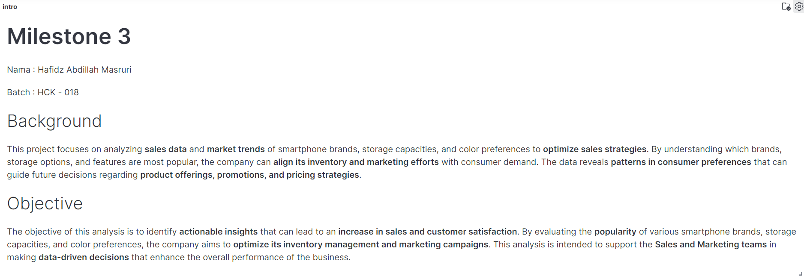
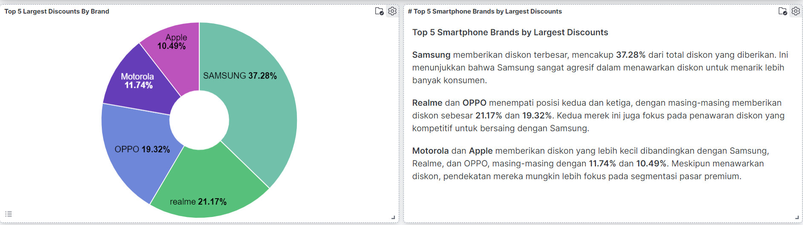
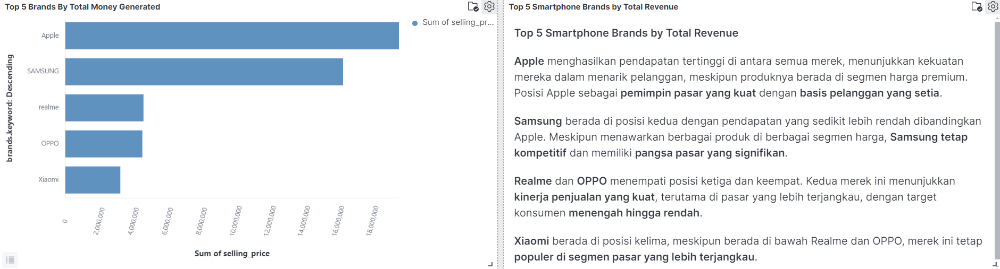
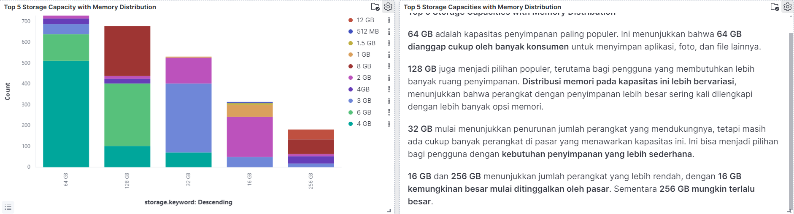
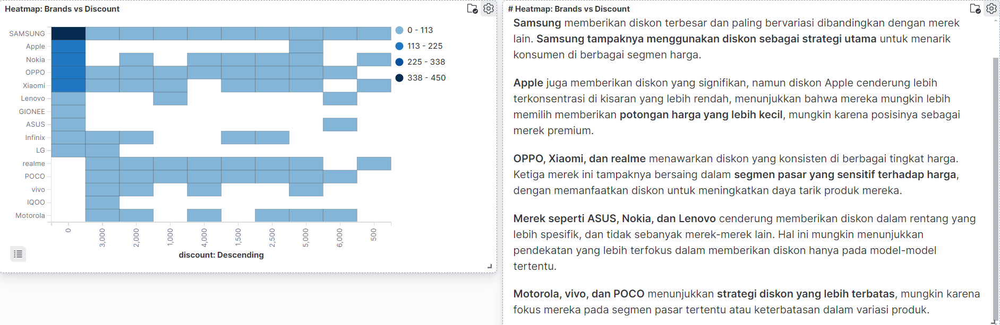
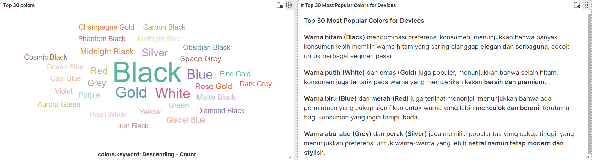
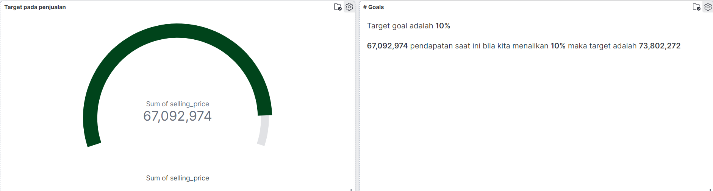
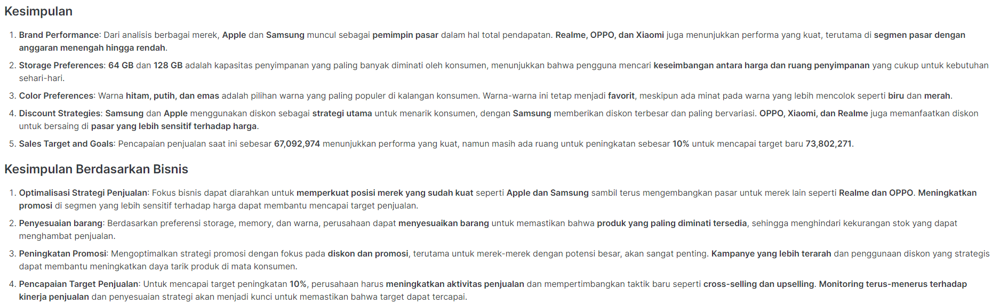

# NeoVenture

  
*logo NeoVenture*

## Pengenalan

NeoVenture adalah platform inovatif yang didedikasikan untuk prediksi harga saham, dengan fokus pada lima perusahaan teknologi terbesar yang terdaftar di New York Stock Exchange (NYSE). Dengan menggabungkan kekuatan algoritma time series dan machine learning, NeoVenture berupaya memberikan perkiraan harga penutupan harian yang akurat. Proyek ini bertujuan untuk membantu investor dalam menyusun strategi investasi jangka pendek yang efektif, dengan tujuan utama memaksimalkan pengembalian dalam portofolio selama satu bulan ke depan.

Dalam pengembangannya, berbagai algoritma time series dievaluasi dan dibandingkan berdasarkan nilai RMSE (Root Mean Square Error), dengan model terbaik di-deploy pada platform Hugging Face. Hasil prediksi ini memberikan wawasan yang lebih mendalam dan membantu investor dalam membuat keputusan yang lebih cerdas di pasar saham yang dinamis.

"Neo" yang berarti "baru" dalam bahasa Latin, dipadukan dengan "Venture," mencerminkan komitmen platform ini untuk membawa inovasi dalam pengambilan keputusan investasi, menghadirkan solusi modern yang dapat diandalkan dalam menghadapi tantangan pasar keuangan.

## Kerangka Kerja

1. **Pengumpulan Data**
   - Data harga penutupan harian dari lima perusahaan teknologi terbesar di NYSE diambil dari sumber-sumber terpercaya.
   - Data diproses dan disiapkan untuk analisis dengan membersihkan data yang hilang dan outlier.

2. **Pengembangan Model Time Series**
   - Beberapa algoritma time series diterapkan untuk memprediksi harga penutupan saham, termasuk ARIMA, LSTM, dan Prophet.
   - Setiap model dievaluasi berdasarkan nilai RMSE untuk menilai kinerjanya dalam prediksi harga saham.

3. **Pemilihan Model Terbaik**
   - Model dengan nilai RMSE terendah dipilih sebagai model terbaik untuk digunakan dalam prediksi jangka pendek.
   - Model terbaik di-deploy pada platform Hugging Face untuk mempermudah akses dan penggunaan dalam strategi investasi.

4. **Implementasi Strategi Investasi**
   - Prediksi harga dari model terbaik digunakan untuk menyusun strategi investasi jangka pendek.
   - Portofolio simulasi dibangun untuk menguji efektivitas strategi dalam memaksimalkan pengembalian dalam periode satu bulan.

5. **Evaluasi dan Validasi**
   - Kinerja portofolio simulasi dievaluasi terhadap data historis untuk memastikan akurasi dan efektivitas prediksi.
   - Hasil evaluasi digunakan untuk menyempurnakan model dan strategi investasi di masa mendatang.

## Project Overview

This project analyzes smartphone sales data to uncover market trends related to brand popularity, storage capacities, and color preferences. The goal is to provide actionable insights that help optimize sales strategies, inventory management, and marketing efforts, thereby enhancing customer satisfaction and overall business performance.

## Notebook Purpose

In this notebook, you will:
1. Extract data using Airflow and PostgreSQL.
2. Clean and preprocess the data.
3. Index the cleaned data into Elasticsearch for analysis.
4. Validate the results through data quality checks

For details and to view the script, check out [this Python script](P2M3_hafidz_masruri_DAG.py).

For validation, check out [this Jupyter Notebook](P2M3_hafidz_masruri_GX.ipynb).

## My Kibana Visualization

